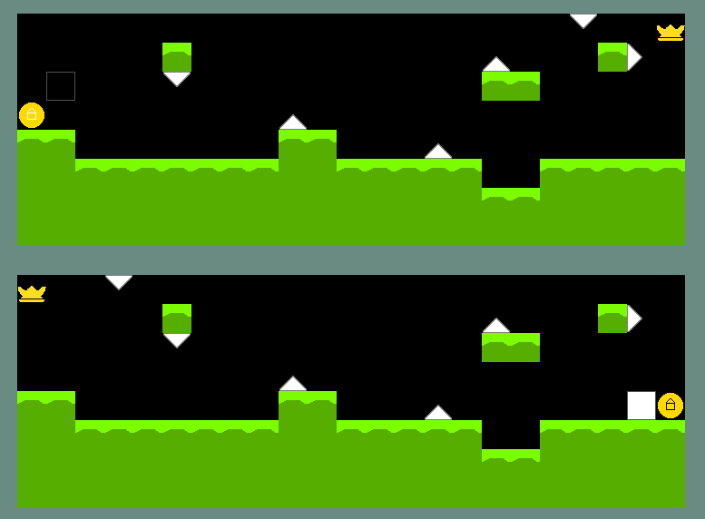

# 🎮 ShadowSwap

> A dual-character mind-bending mini puzzle game made with Lua + LOVE2D.

[](https://github.com/KKNecmi/ShadowSwap/releases/)
[](#license)
[](https://github.com/KKNecmi/ShadowSwap/issues)

---

## :dart: Game Idea

- A **light character** appears in the **upper half** of the screen  
- A **shadow character** moves in the **bottom half**  
- They move **simultaneously**, but one moves in the **opposite direction**  
- Goal: Reach the **correct goal tiles** with both characters at the same time  
- A level-based concept designed to **challenge your brain with mirrored movement**

---

## :video_game: Controls

| Key | Action |
|-----|--------|
| ↑ ↓ ← → | Move both characters at the same time |
| Enter | Skip transition screens |
| Mouse | Click menu buttons |

---

## :bulb: Technologies Used

- **Lua**
- **LOVE2D (version 11.x)** – 2D Game Engine
- Sprite drawing and animation
- Level parsing via `.json` map files (`levels/*.json`)

---


## 🖼️ Screenshot

<p align="center">
  
</p>

---

## 📂 How to Run the Game

### 🔹 1. Run using `.love` file
```bash
love ShadowSwap.love
